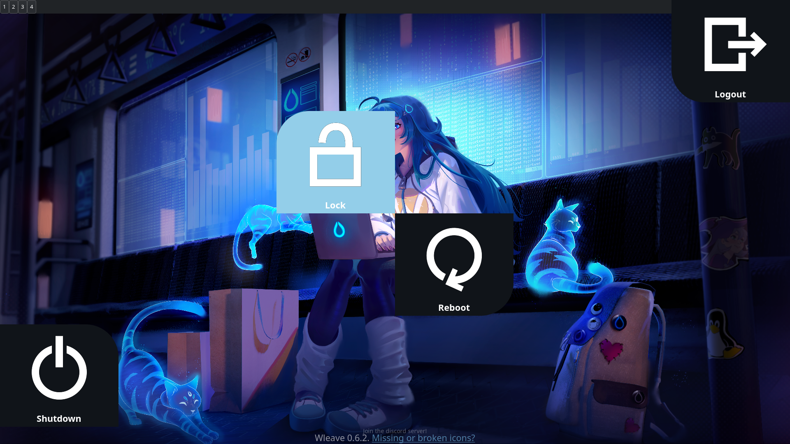

Note that for the purposes of this customization, wlogout is a drop-in replacement for wleave.

# Removed Options:
Removed hibernate as an option since I wasn't using it, however here it is for those who need it:

{
  "label": "hibernate",
  "action": "systemctl hibernate",
  "text": "Hibernate",
  "keybind": "h",
  "icon": "/usr/share/wleave/icons/hibernate.svg"
},

The hibernate option is originally placed between lock and logout in layout.json

HyDE uses something along the lines of 
`hyprctl -j getoption decoration:rounding | jq '.int'`
in order to compute for a hypr_border.

There is also another block of code that sets a default assignment if hypr_border is unset, null, or empty, which is this:
hypr_border="${hypr_border:-10}"
This sets a default value of 10 for hypr_border, hypr_border has yet to have a value.

Executing this in my system, this results in: 10
From there, we can compute the following other values:

export active_rad=$((hypr_border * 5)) which equates to 50
export button_rad=$((hypr_border * 8)) and this which equates to 80

Then for the margin and hover, it is computed from the width (x) and height (y) of the monitor:

x_mon=$(hyprctl -j monitors | jq '.[] | select(.focused==true) | .width')
y_mon=$(hyprctl -j monitors | jq '.[] | select(.focused==true) | .height')

Which, when executed on my system, yields:
x_mon=1920
y_mon=1080

The scaling is also computed via this:
hypr_scale=$(hyprctl -j monitors | jq '.[] | select (.focused == true) | .scale' | sed 's/\.//')

Which yields:
hypr_scale=100

Note that in my case, a 1920x1080 (also known as Full High Defintion; FHD) resolution is equivalent to 16/9 scale with a factor of 120.
Other cases involve a 2560x1440 (also known as Quad High Definition; QHD) resolution, equivalent to 16/9 scale with a factor of 160,
and a 3840x2160 (also known as Ultra High Definition; UHD or more popularly known as 4K) resolution, equivalent to 16/9 scale with a factor of 240.

HyDE has two configurations of wlogout which depend on the number of columns that it has:
1. One has 6 columns (which contains all of the buttons) and in a single row only.
2. The second one has 2 columns, however it only has 2 rows, which means it only shows 4 buttons, notably with the suspend and hibernate buttons removed.

Based on these two cases, HyDE does the following computations:
1. For the 1x6 (row x column) setup:
export mgn=$((y_mon * 28 / hypr_scale))
export hvr=$((y_mon * 23 / hypr_scale))
Which yields the following on my FHD setup:
mgn=(1080 * 28 / 100)=302.4
hvr=(1080 * 23 / 100)=248.4
2. For the 2x2 setup:
export x_mgn=$((x_mon * 35 / hypr_scale))
export y_mgn=$((y_mon * 25 / hypr_scale))
export x_hvr=$((x_mon * 32 / hypr_scale))
export y_hvr=$((y_mon * 20 / hypr_scale))
Which yields the following on my FHD setup:
x_mgn=(1920 * 35 / 100)=672
y_mgn=(1080 * 25 / 100)=270
x_hvr=(1920 * 32 / 100)=614.4
y_hvr=(1080 * 20 / 100)=216

As for the font:
export fntSize=$((y_mon * 2 / 100))

Which results in this for my FHD setup:
fntSize=(y_mon * 2 / 100)=21.6

Other miscellaneous stuff:
According to HyDE's source code:
@main-bg is #101419
${BtnCol} is either "black" or "white"
@wb-act-bg (wb being "waybar", and act being "active") is #93cee9
@wb-hvr-bg (hvr being "hover") is also #93cee9

Strangely enough, for the 2-column (2x2) layout, even though I copy and pasted the layout and the style files verbatim (only substituting the variables as explained in this note), it resulted in this weird image:


It was only fixed by switching places between the logout and shutdown buttons for the 2x2_layout.json:
```
lock...
{
  "label": "shutdown",
  "action": "systemctl poweroff",
  "text": "Shutdown",
  "keybind": "s",
  "icon": "/usr/share/wleave/icons/shutdown.svg"
},
{
  "label": "logout",
  "action": "hyprshutdown >/dev/null 2>&1 && hyprshutdown || hyprctl dispatch exit",
  "text": "Logout",
  "keybind": "e",
  "icon": "/usr/share/wleave/icons/logout.svg"
},
reboot...
```
Instead of this (the original config, as seen from HyDE's repository):
```
lock...
{
  "label": "logout",
  "action": "hyprshutdown >/dev/null 2>&1 && hyprshutdown || hyprctl dispatch exit",
  "text": "Logout",
  "keybind": "e",
  "icon": "/usr/share/wleave/icons/logout.svg"
},
{
  "label": "shutdown",
  "action": "systemctl poweroff",
  "text": "Shutdown",
  "keybind": "s",
  "icon": "/usr/share/wleave/icons/shutdown.svg"
},
reboot...
```

Or, switching styles from 2x2_style.css, still from the shutdown and logout buttons:
```css
button:hover#logout { /* the config was swapped with button:hover#shutdown to fix the bug */
    border-radius: 50px 50px 50px 0px;
    margin: 216px 614.4px 0px 0px;
}

button:hover#shutdown {
    border-radius: 50px 0px 50px 50px;
    margin: 0px 0px 216px 614.4px;   
}

#logout { /* the config was swapped with #shutdown to fix the bug */
    border-radius: 0px 80px 0px 0px;
    margin: 270px 672px 0px 0px;
}

#shutdown {
    border-radius: 0px 0px 0px 80px;
    margin: 0px 0px 270px 672px;
}
```
Instead of this (the original config, as seen from HyDE's repository):
```css
button:hover#logout {
    border-radius: 50px 0px 50px 50px;
    margin: 0px 0px 216px 614.4px;
}

button:hover#shutdown {
    border-radius: 50px 50px 50px 0px;
    margin: 216px 614.4px 0px 0px;
}

#logout {
    border-radius: 0px 0px 0px 80px;
    margin: 0px 0px 270px 672px;
}

#shutdown {
    border-radius: 0px 80px 0px 0px;
    margin: 270px 672px 0px 0px;
}
```

Note I didn't apply *both* fixes. And the simpler fix was switching the layouts instead of the styles, which is what I opted to do instead.

If anyone could explain why this weird phenomenon happened, I would be glad to be enlightened as to why. Maybe this is just skill issue on my part. Or maybe it could be a genuine bug from HyDE's configs.
